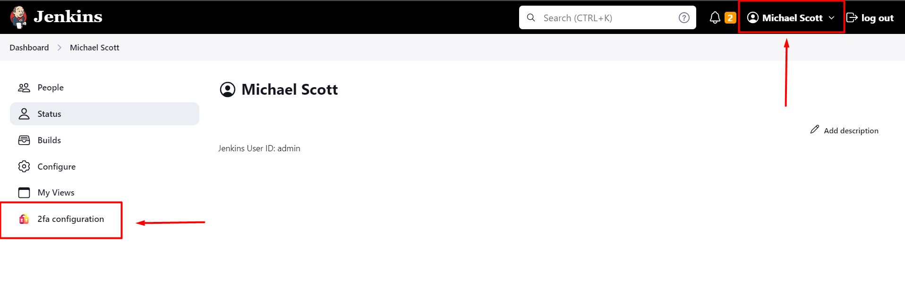
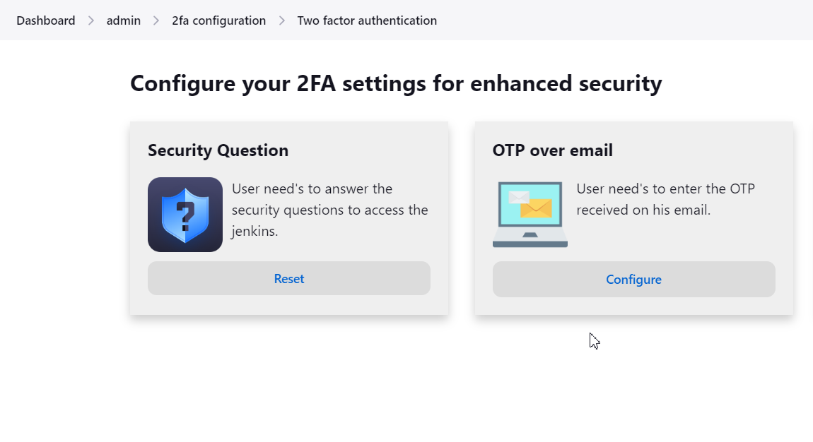
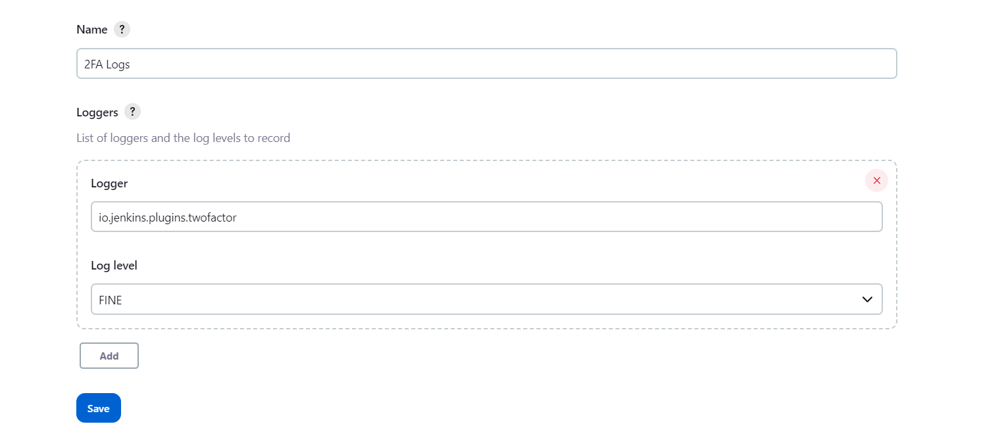

# Two-Factor Authentication for Jenkins

**Two-Factor Authentication for Jenkins** Plugin adds a layer of security to Jenkins authentication by requiring users
to provide a second factor of authentication along with their username and password.
It enhances the overall security of your Jenkins environment. Additionally, this plugin does not require you to extend the security realm, making it easier to implement and use.

**Supported Authentication method**

* Security Questions
* OTP over email
* Duo Push Notification [Available in Premium version]
* Mobile Authenticator [Available in premium version]
* Yubikey hardware token [Available in premium version]
* OTP over SMS [Available in premium version]
* Backup code [Available in premium version]

**Features of Jenkins 2FA plugin**

* Enable and disable 2FA for all users in a single click [Free]
* 2FA supported for all security realms [Free]
* Easy configuration [Free]
* Enable 2FA for users in specific groups [Premium]
* Disable 2FA for users in specific groups [Premium]

**&#x261E; Your unique requirements or feature requests are always welcome by our team, Feel free to write us at info@xecurify.com and we will customize our solutions to your needs.**

# Installation Instructions

* **Please follow [this](https://miniorange.com/atlassian/jenkins-two-factor-authentication/) guide for installation and activation of the plugin.**
# Reset Security methods

* Go to your user profile and click on the 2FA configuration button in the side panel.

* Choose the "**Reset**" or "**Configuration**" option to either reset the currently configured authentication method or set up a new method if it is currently not configured

# Troubleshooting and Logging
Refer below steps to generate error Logs and send it to info@xecurify.com. We will help you
resolve your issue in no time.
* Sign in to Jenkins as an admin and select Manage Jenkins from the left panel of the dashboard.
* Scroll down to find the System Log option.
* Click Add new Log Recorder button and add the log recorder name as 2FaLogs.
* Add **io.jenkins.plugins.twofactor** as a Logger and select fine as a log level.
  
* Save the settings.
* Perform 2FA on another browser/private window to record logs.
* Visit the System Log option again and copy the recorded logs from the 2FaLogs logger.
* Paste logs in a notepad/word file and send it to us.
* You can even reach us at info@xecurify.com or raise a ticket using this [link](https://miniorange.atlassian.net/servicedesk/customer/portal/2%22).
